# The Sea Words

Ahoy sailor! [The Sea Words](https://the-sea-words.herokuapp.com/) is a website where you can search, add and even edit nautical terms from the Golden Age of Sail!


### UX
 
### First Time User
- As a first time user, I want the function of the site to be obvious.
- As a first time user, I want to be able to search.
- As a first time user, I want the process whereby I can add my own entry to be obvious.
- As a first time user, I want the option to sign up and add my own listing. 

### Regular User
- As a regular user, I want to option to edit any entry I see as inaccurate.
- As a regular user, I want assurance that my enteries cannot be deleted by bad actors.
- As a regular user, I want the abilty to search for entries. 
- As a regular user, I want the ability to see whom entries have been added by.
- As a regular user, I want it to be immediately obvious upon visiting the site whether I am logged in or not.

*   ### Design

    -   #### Colour Scheme
        -   The main colours used are Blue (#) and white, in-keeping with the nautical theme. 
    -   #### Typography
        -   The Bodoni Moda font is the main font used in the game. This font was chosen for its 'classical' look which reflects the historical nature of the site. 
    -   #### Imagery
        -   The rope coil background image was selected to tie into the natical theme of the site to visitors and users. 
    -   #### Layout
        -   Materialize was used to assist with the layout and styling of this site. 

*   ### Wireframes

    -   Home Page Wireframe (Mobile) - [View](https://bit.ly/3cW5VBx), Desktop - [View](https://bit.ly/3tIkqzK)
    -   Random Page (Mobile) - [View](https://bit.ly/3cSYyem), Desktop - [View](https://bit.ly/3f5fNvA)
    -   Add/Edit Page (Mobile) - [View](https://bit.ly/3c6pRCI), Desktop - [View](https://bit.ly/392Tq6e)
    -   Register/ Login Page (Mobile) - [View](https://bit.ly/3skSHVq), Desktop - [View](https://bit.ly/3c4W7WH)


## Features
 
### Existing Features
- Editing capabilities: All logged in users can edit terms.
- Only the original author can delete their post.
- Random term generator: generates a random term at the click of a button.
- Login/ Register: ability to sign up or in, in order to add terms.


### Features Left to Implement
- Browse by Letter feature: this will enable a more orderly perusal of terms. 
- Last Updated tag: this feature would allow readers to see when and by whom a listing was last edited/added.


## Technologies Used

#### Languages:
- [HTML5](https://en.wikipedia.org/wiki/HTML5) 
- [CSS3](https://en.wikipedia.org/wiki/Cascading_Style_Sheets)
- [jQuery](https://jquery.com/)
- [Python](https://www.python.org/)

#### Frameworks & Libraries:
- [Gitpod](https://www.gitpod.io/) 
- [GitHub](https://github.com/)
- [Flask](https://flask.palletsprojects.com/en/1.1.x/)
- [Google Fonts](https://fonts.google.com/)
- [Materialize](https://materializecss.com/)
- [MongoDB](https://www.mongodb.com/)
- [Heroku](https://dashboard.heroku.com/)
- [Jinja](https://jinja.palletsprojects.com/en/2.11.x/)

## Testing - User Stories
### New User
- "As a first time user, I want the function of the site to be obvious."
    1. Text announces purpose of the site upon entry.  
- "As a first time user, I want to be able to search."
    1. Homepage contains a search function.
- "As a first time user, I want the process whereby I can add my own entry to be obvious."
    1. Navbar contains option to add new word when logged in.
- "As a first time user, I want the option to sign up and add my own listing." 
    1. Easy register option provides the opportunity to sign up quickly.

 ### Regular User
- "As a regular user, I want to option to edit any entry I see as inaccurate."
    1. The option to edit any listing is available once logged in.
- "As a regular user, I want assurance that my enteries cannot be deleted by bad actors."
    1. Only the original author and the Admin have the power to delete a listing.
- "As a regular user, I want the abilty to search for entries."
    1. There is a search function clearly visible at the top of the home page.
- "As a regular user, I want the ability to see whom entries have been added by."
    1. The post's author appears on each entry.
- "As a regular user, I want it to be immediately obvious upon visiting the site whether I am logged in or not."
    2. Only logged in visitor can see the edit/delete option, or the Add Word/Logout navbar item.
   

## Testing - Functionality
1. Search function:
    1. Go to the Home page
    2. Try to submit the empty search and verify that an error message about the required fields appears
    3. Try to submit the search with less than 3 letters verify that a relevant error message appears
    4. Try to submit the search with all inputs valid and verify that a success message appears.

2. Login Page:
    1. Try to submit incorrect login details and verify an error appears.

3. Register Page
    1. Try to register using an existing username and verify error appears
    2. Try to register a username using fewer than 3 letters and verify error appears. 

4. Add/ Edit Word Page: 
    1. Attempt to enter a term with fewer than 3 letters and verify error appears.
    2. Attempt to enter fewer than 10 letters, or more than 300 in the description field and verify error appears.
    3. Attempt to enter fewer than 10 letters, or more than 200 in the use in a sentence field and verify that an error appears. 

The W3C Markup Validator and W3C CSS Validator Services were used to validate every page of the project to ensure there were no syntax errors in the project.

-   [W3C Markup Validator](https://jigsaw.w3.org/css-validator/#validate_by_input) -
Results
1. 404 
2. add word 
3. base 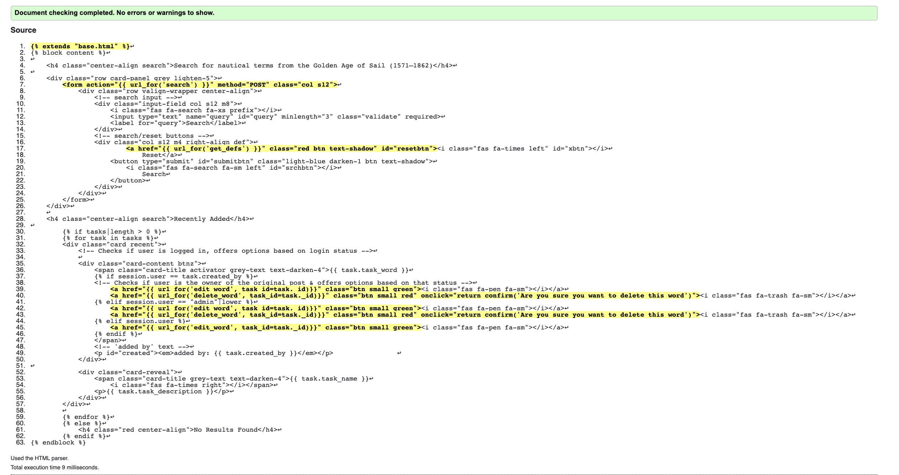
4. edit_word 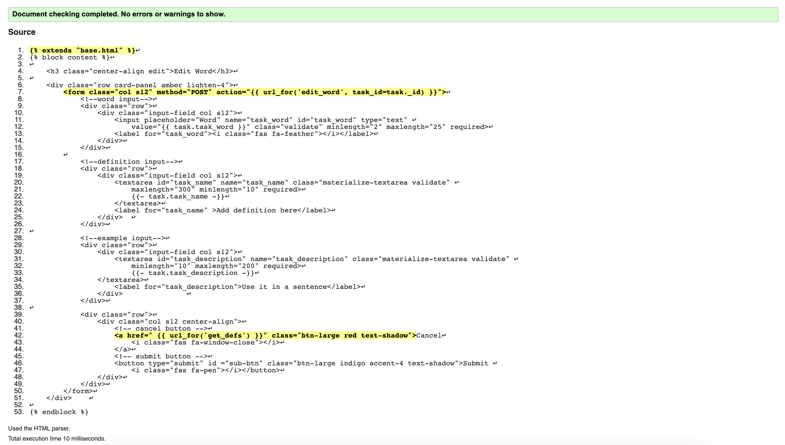
4. home 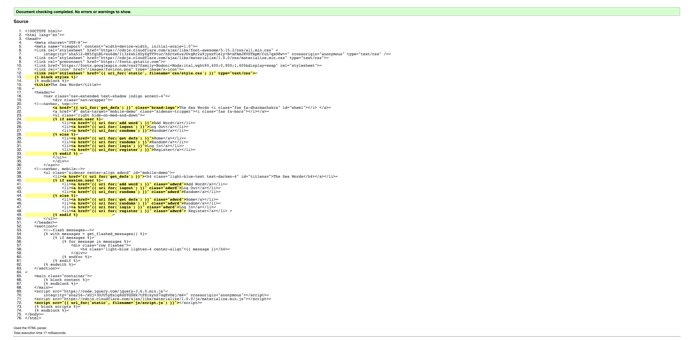
4. login 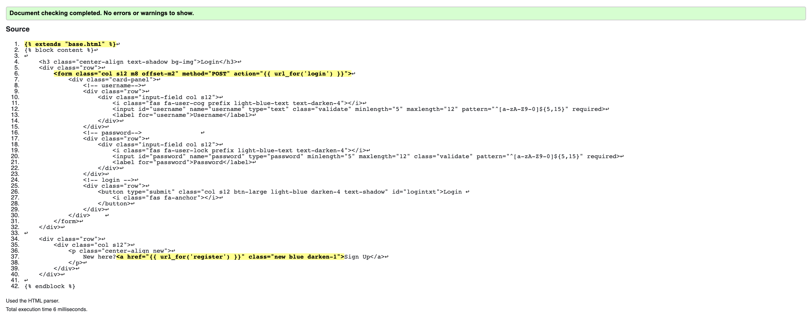
4. random 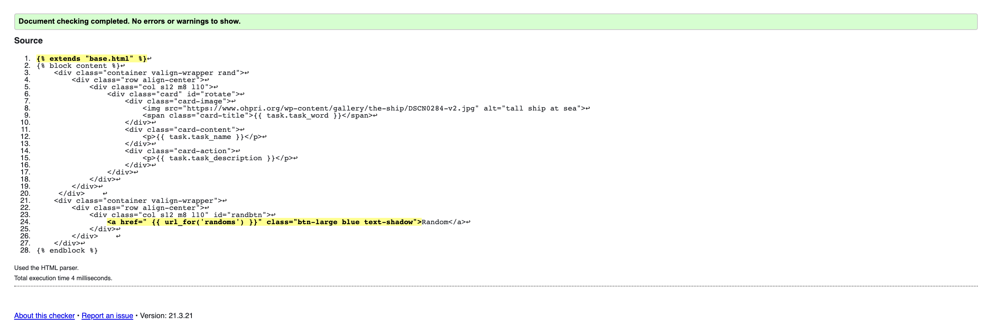
4. register 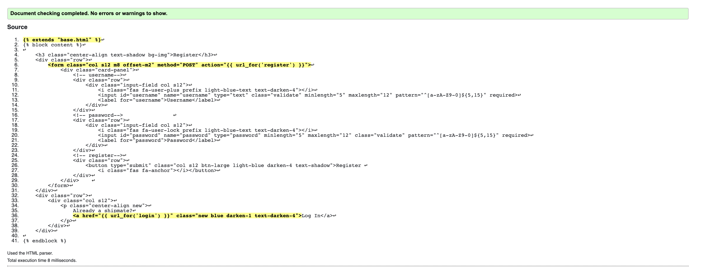

-   [W3C CSS Validator](https://jigsaw.w3.org/css-validator/#validate_by_input) - Results
1.  CSS 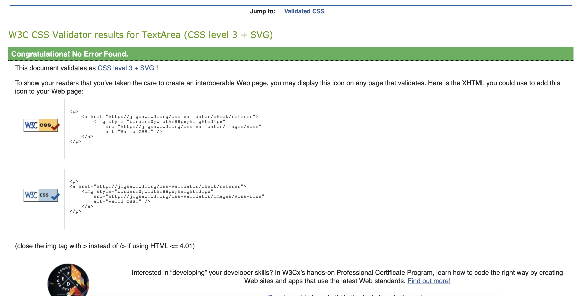

-   [PEP8](http://pep8online.com/) - Results
1.  Python Checker 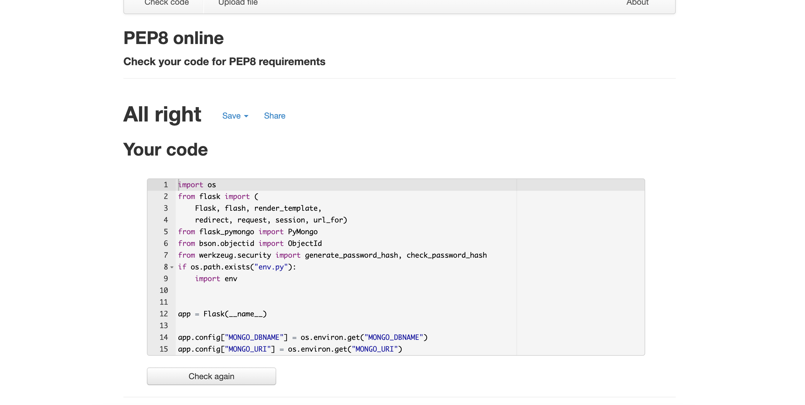

-   [JS](http://pep8online.com/) - Results
1.  Javascript checker 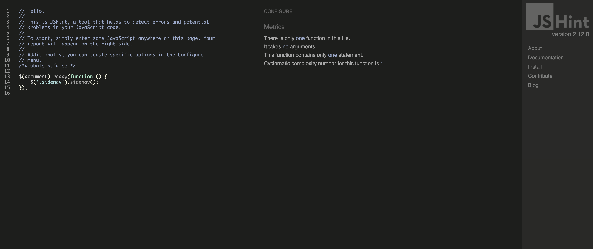


This site has been tested as working on the following browsers: Chrome/Firefox/Safari and also tested using Chrome Dev tools on the following Mobile devices: Moto4, Galaxy s5/Fold, iPhone:5, SE, 6,7,8 Plus, X; Surface Tablet, iPad, iPad Pro. 


## Bugs
1. Resolved issue: old data related to incorrect password pattern continued to show in Chrome Dev tools despite being reloaded, cache cleared and viewed in Incognito. This issue was resolved by stopping and restarting by server, on advice from Code Institute mentor.

## Deployment

Instructions on deploying this project to Github:
### Making a Local Clone

1. Log in to GitHub and locate the [GitHub Repository](https://github.com/mcranter/Milestone3)
2. Under the repository name, click "Clone or download".
3. To clone the repository using HTTPS, under "Clone with HTTPS", copy the link.
4. Open Git Bash
5. Change the current working directory to the location where you want the cloned directory to be made.
6. Type `git clone`, and then paste the URL you copied in Step 3.

```
$ git clone https://github.com/mcranter/Milestone3
```
7. Press Enter. Your local clone will be created.

```
$ git clone https://github.com/mcranter/Milestone3
> Cloning into `CI-Clone`...
> remote: Counting objects: 10, done.
> remote: Compressing objects: 100% (8/8), done.
> remove: Total 10 (delta 1), reused 10 (delta 1)
> Unpacking objects: 100% (10/10), done.
```

Click [here](https://help.github.com/en/github/creating-cloning-and-archiving-repositories/cloning-a-repository#cloning-a-repository-to-github-desktop) to retrieve pictures for some of the buttons and more detailed explanations of the above process.


#### Working with the local copy
1. Install all the requirements: Go to the workspace of your local copy. In the terminal window of your IDE type: **pip3 install -r requirements.txt**.
2. Create a database in MongoDB  
    - Signup or login to your MongoDB account.
    - Create a cluster and a database.
    - Create one collections in the db: Terms
    3. Create the environment variables 
    - Create a .gitignore file in the root directory of the project.
    - Add the env.py file in the .gitignore.
    - Create the file env.py. This  will contain all the envornment variables.
    ```
    Import os
    os.environ.setdefault("IP", "Added by developer")
    os.environ.setdefault("PORT", "Added by developer")
    os.environ.setdefault("SECRET_KEY", "Added by developer")
    os.environ.setdefault("MONGO_URI", "Added by developer")
    os.environ.setdefault("MONGO_DBNAME", "Added by developer")
    ```
4. Run the app: Open your terminal window and enter 'python3 app.py' to start the app.

#### Heroku Deployment  
1. Set up local workspace for Heroku 
    - In terminal window of your IDE type: **pip3 freeze -- local > requirements.txt.** 
    - In termial window of your IDE type: **python app.py > Procfile** 
2. Set up Heroku: create a Heroku account and create a new app. 
3. Deployment method 'Github'
    - Click on the **Connect to GitHub** section in the deploy tab in Heroku. 
        - Search your repository to connect with it.
        - When your repository appears click on **connect** to connect your repository with the Heroku. 
    - Go to the settings app in Heroku and go to **Config Vars**. Click on **Reveal Config Vars**.
        - Enter the variables contained in your env.py file. it is about: **IP, PORT, SECRET_KEY, MONGO_URI, MONGO_DBNAME**
4. Push the requirements.txt and Procfile to repository. 
     ```
    $ git add requirements.txt
    $ git commit -m "Add requirements.txt"

    $ git add Procfile 
    $ git commit -m "Add Procfile"
    ```
5. Automatic deployment: Go to the deploy tab in Heroku and scroll down to **Automatic deployments**. Click on **Enable Automatic Deploys**. By **Manual deploy** click on **Deploy Branch**.


## Database structure: 
- View Categories 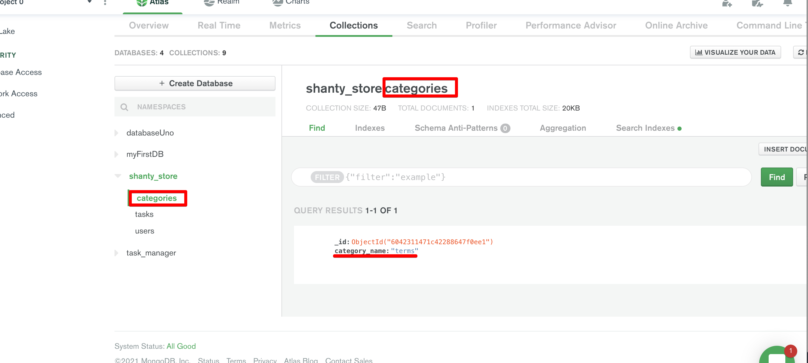
- View Users  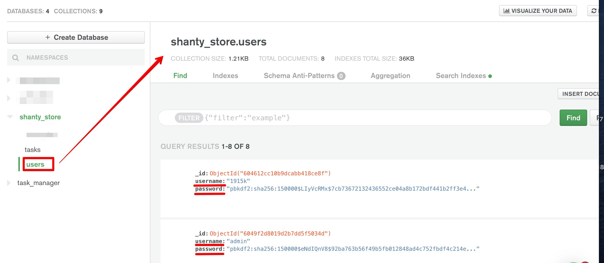
- View Tasks 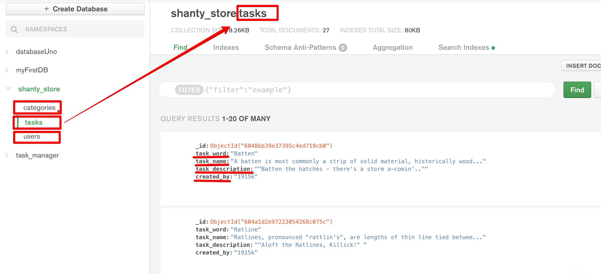

## Credits

### Content
- This site was built following the available Code Institue learning materials. Specifically Tim Nelson's Mongo DB Mini Project, which was used as the basis for this project.

### Media
- The photos used in this site were obtained from Pixabay and [Oliver Hazard Perry, Rhode Island](https://www.ohpri.org/)

### Acknowledgements

- I received inspiration for this project from the Aubrey/Maturin novels of Patrick O'Brien.
